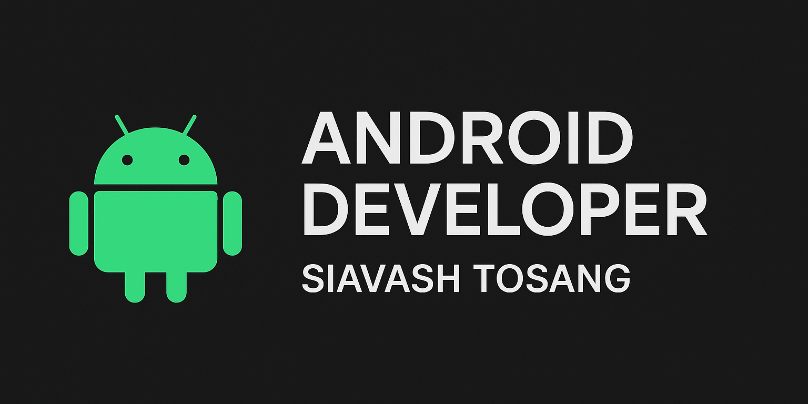

# SiavshTosangDev

  

# Hi there 👋 I'm Siavash!

I'm a passionate **Android Developer** based in Iran 🇮🇷, focused on building clean, efficient, and beautiful mobile applications.  
Currently working with **Kotlin**, **Jetpack Compose**, **MVVM**, and **modern Android architectures**.  
I'm always looking to learn, grow, and collaborate on exciting new projects!

## 🚀 Skills:
- Android SDK
- Jetpack Compose
- Android Views
- MVVM Architecture
- Dependency Injection (Hilt)
- REST API Integration
- Room Database
- Git & GitHub

## 🎯 Goals:
- Master advanced Android development
- Publish high-quality apps on Google Play
- Learn about Clean Architecture and scalable app design
- Contribute to open-source Android projects

## 📫 How to reach me:
- Email: siavashtosang@gmail.com
- Let's connect on [LinkedIn](https://www.linkedin.com/in/siavashtosang/)!

---

_"Code with passion, build with purpose."_ 🚀
